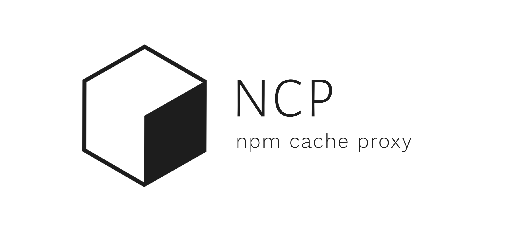

<h1 align="center">
 

npm-cache-proxy
</h1>

<p align="center">
  <a href="https://hub.docker.com/r/emeralt/npm-cache-proxy/tags">
    
  </a>
  <a href="https://hub.docker.com/r/emeralt/npm-cache-proxy/builds">
    
  </a>
  <a href="https://github.com/emeralt/npm-cache-proxy/blob/master/liscense">
    
  </a>
</p>

> `npm-cache-proxy` is a lightweight npm caching proxy written in Go that achives warp speeds by using Redis for data storage. B-b-blazing fast!


<details>
<summary>Table of Contents</summary>
<p>

- [Getting started](#getting-started)
- [CLI](#cli)
	- [`ncp`](#ncp)
	- [`ncp list`](#ncp-list)
	- [`ncp purge`](#ncp-purge)
- [Programmatic usage](#programmatic-usage)
	- [Example](#example)
- [Deployment](#deployment)
- [Benchmark](#benchmark)
- [License](#license)

</p>
</details>

## Getting started
Release binaries for different platforms can be downloaded on the [Releases](https://github.com/emeralt/npm-cache-proxy/releases) page. Also, [Docker image](https://cloud.docker.com/u/emeralt/repository/docker/emeralt/npm-cache-proxy) is provided.

The fastest way to get started with NCP is to use Docker image:
```bash
# run proxy inside of docker container in background
docker run -e REDIS_ADDRESS=host.docker.internal:6379 -p 8080:8080 -it emeralt/npm-cache-proxy -d

# configure npm to use caching proxy as registry
npm config set registry http://localhost:8080
```

## CLI
Additionally, NCP provides a command line utility for proxy configuration and data management.

---

| Global Options                | Env              | Default                 | Description       |
| ----------------------------- | ---------------- | ----------------------- | ----------------- |
| `--redis-address <address>`   | `REDIS_ADDRESS`  | `http://localhost:6379` | Redis address     |
| `--redis-database <database>` | `REDIS_DATABASE` | `0`                     | Redis database    |
| `--redis-password <password>` | `REDIS_PASSWORD` | -                       | Redis password    |
| `--redis-prefix <prefix>`     | `REDIS_PREFIX`   | `ncp-`                  | Redis keys prefix |

---

### `ncp`

Start proxy server.

```bash
ncp --listen "localhost:1234" # listen on port 1234
```

| Options                 | Env                | Default                      | Description                         |
| ----------------------- | ------------------ | ---------------------------- | ----------------------------------- |
| `--listen <address>`    | `LISTEN_ADDRESS`   | `locahost:8080`              | Address to listen                   |
| `--upstream <address>`  | `UPSTREAM_ADDRESS` | `https://registry.npmjs.org` | Upstream registry address           |
| `--cache-limit <count>` | `CACHE_LIMIT`      | -                            | Cached packages count limit         |
| `--cache-ttl <timeout>` | `CACHE_TTL`        | `3600`                       | Cache expiration timeout in seconds |

---

### `ncp list`
List all cached packages.

---

### `ncp purge`
Purge all cached packages.

---

## Programmatic usage
Along with the CLI, go package is provided. Documentation is available on [godoc.org](https://godoc.org/github.com/emeralt/npm-cache-proxy/proxy).

```bash
go get -u github.com/emeralt/npm-cache-proxy/proxy
```

### Example
```golang
package main

import (
	"net/http"
	"time"

	npmproxy "github.com/emeralt/npm-cache-proxy/proxy"
	redis "github.com/go-redis/redis"
)

func main() {
	proxy := npmproxy.Proxy{
		// you can provide you own Database
		// or use an existing one
		Database: npmproxy.DatabaseRedis{
			Client: redis.NewClient(&redis.Options{
				Addr:     "localhost:6379",
			}),
		},

		// allows to reuse tcp connections
		HttpClient: &http.Client{},

		// allows to get options dynamically
		GetOptions: func() (npmproxy.Options, error) {
			return npmproxy.Options{
				DatabasePrefix:     "ncp-",
				DatabaseExpiration: 1 * time.Hour,
				UpstreamAddress:    "https://registry.npmjs.org",
			}, nil
		},
	}

	// listen on http://localhost:8080
	proxy.Server(npmproxy.ServerOptions{
		ListenAddress: "localhost:8080",
	}).ListenAndServe()
}
```

## Deployment
NCP can be deployed using Kubernetes, Docker Compose or any other container orchestration platform. NCP supports running indefinite amount of instances simultaneously. 

## Benchmark
Macbook Pro 15″ 2017, Intel Core i7-7700HQ. Note `GOMACPROCS=1`. 

```bash
# GOMAXPROCS=1 ncp --listen localhost:8080

$ go-wrk -c 100 -d 5 http://localhost:8080/ascii
Running 5s test @ http://localhost:8080/ascii
  100 goroutine(s) running concurrently
33321 requests in 5.00537759s, 212.69MB read
Requests/sec:		6657.04
Transfer/sec:		42.49MB
Avg Req Time:		15.02169ms
Fastest Request:	230.514µs
Slowest Request:	571.420487ms
Number of Errors:	0
```

## License

[MIT](./license)
